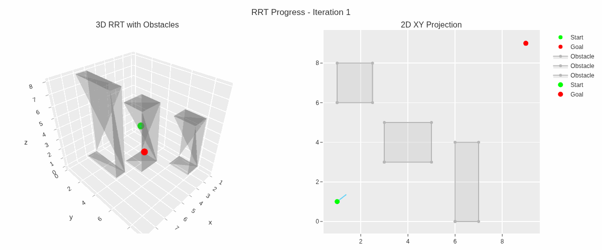

# Rapidly-exploring Random Tree (RRT) Algorithm

## Overview
The Rapidly-exploring Random Tree (RRT) algorithm is a sampling-based path planning algorithm used to find feasible paths in high-dimensional spaces, particularly for robotic motion planning. It is designed to efficiently explore complex environments with obstacles by incrementally building a tree of possible paths from a start point to a goal point.

## How RRT Works
The RRT algorithm operates by constructing a tree rooted at the starting configuration and incrementally extending it toward randomly sampled points in the configuration space. The key steps are:

1. **Initialization**: Start with a tree containing only the initial configuration (starting point).
2. **Random Sampling**: Generate a random point in the configuration space.
3. **Nearest Neighbor**: Find the node in the tree closest to the random point (using a distance metric, e.g., Euclidean distance).
4. **Extension**: Extend the tree from the nearest node toward the random point by a fixed step size, ensuring the new edge is collision-free.
5. **Goal Check**: If the new node is close to the goal, attempt to connect it to the goal. If successful, a path is found.
6. **Iteration**: Repeat steps 2–5 until a path to the goal is found or a maximum number of iterations is reached.

## Key Features
- **Efficient Exploration**: RRT rapidly covers the configuration space, making it suitable for high-dimensional problems.
- **Probabilistic Completeness**: Given enough iterations, RRT will find a path if one exists.
- **Obstacle Avoidance**: The algorithm naturally avoids obstacles by checking for collisions during extension.
- **Applications**: Widely used in robotics, autonomous vehicles, and game development for path planning.

## Implementation
The code provided implements the RRT algorithm in [insert programming language, e.g., Python]. It includes:
- A configuration space with defined boundaries.
- Obstacle definitions (e.g., polygons or circles).
- Functions for random sampling, nearest neighbor search, collision checking, and tree extension.
- Visualization of the tree growth and final path.

### Prerequisites
- [List dependencies, e.g., Python 3.x, NumPy, Matplotlib]
- Ensure the GIF file (demonstrating the algorithm) is placed in the same directory as the code.

### Running the Code
1. Clone the repository or download the code.
2. Install required dependencies: `[e.g., pip install numpy matplotlib]`.
3. Run the script: `[e.g., python RRT.ipynb]`.
4. The algorithm will generate a path from the start to the goal, avoiding obstacles, and display the result.

## Example Output
The following GIF demonstrates the RRT algorithm in action, showing the tree growth and the final path from the start to the goal in a 2D and 3D environment with obstacles:

